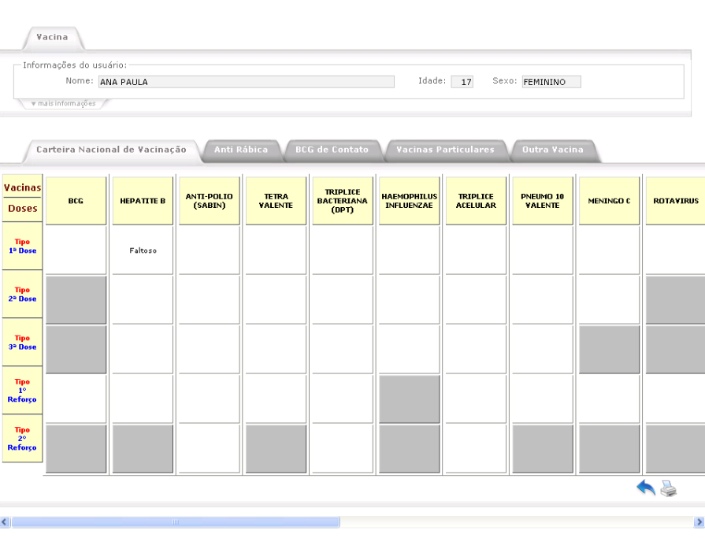
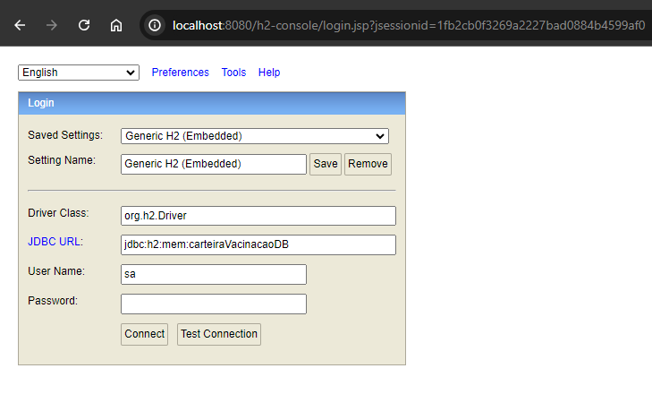

# Carteira Vacinação

Este projeto é uma aplicação backend para gerenciamento de uma carteira de vacinação, desenvolvida utilizando o framework Spring. A aplicação permite a manipulação de dados para a gestão de carteiras de vacinação.



## Requisitos do Projeto

**Requisitos Funcionais**
   
   ✅ Cadastrar uma vacina: Uma vacina consiste em um nome e um identificador único.
   
   ✅ Cadastrar uma pessoa: Uma pessoa consiste em um nome e um número de identificação único.
   
   ✅ Remover uma pessoa: Uma pessoa pode ser removida do sistema, o que também implica na exclusão de seu cartão de vacinação e todos os registros associados.
   
   ✅ Cadastrar uma vacinação: Para uma pessoa cadastrada, é possível registrar uma vacinação, fornecendo informações como o identificador da vacina e a dose aplicada (A dose deve ser validada pelo sistema).
   
   ✅ Consultar o cartão de vacinação de uma pessoa: Permite visualizar todas as vacinas registradas no cartão de vacinação de uma pessoa, incluindo detalhes como o nome da vacina, data de aplicação e doses recebidas.
   
   ✅ Excluir registro de vacinação: Permite excluir um registro de vacinação específico do cartão de vacinação de uma pessoa.

**Requisitos Técnicos**

✅ A comunicação deve ser realizada via JSON, seguindo as melhores práticas para APIs REST.

✅ Recomenda-se utilizar boas práticas de programação para a linguagem escolhida.

✅ A implementação de testes unitários é encorajada para garantir a robustez do sistema.

➡️ A implementação de autenticação na API é um bonus.

## Tecnologias Utilizadas


- **Java**: Como linguagem de programação principal.
- **Spring**: Como framework principal.
- **Spring Data JPA**: Para a persistência de dados.
- **Spring Web**: Para a criação de APIs REST.
- **H2 Database**: Para testes de integração.
- **Junit 5**: Para testes unitários.
- **Swagger**: Para documentação do código.

## Instruções de Configuração

1.**Iniciar Aplicação**

1.1.Clonar o repositório

```
git clone https://github.com/Pybony/carteira_vacinacao.git
```

1.2.Contruir o projeto

```
./mvnw clean install
```

1.3.Rodar a aplicação

```
java -jar target/carteira_vacinacao-0.0.1-SNAPSHOT.jar
```

2.**Popular Banco (Opcional)**

Acessar http://localhost:8080/h2-console

Script para inserir dados


```
INSERT INTO pessoas (nome, data_nascimento, sexo) VALUES ('João Silva', '1994-07-24', 'MASCULINO');
INSERT INTO pessoas (nome, data_nascimento, sexo) VALUES ('Pedro Costa', '2006-09-16', 'MASCULINO');
INSERT INTO pessoas (nome, data_nascimento, sexo) VALUES ('Paula Martins', '2001-12-05', 'FEMININO');

INSERT INTO vacinas (nome, esquema_vacinacao) VALUES ('Hepatite B', 'DOSE_UNICA');
INSERT INTO vacinas (nome, esquema_vacinacao) VALUES ('Tetravalente ', 'DOSE_DUPLA');

SELECT * FROM vacinas;

SELECT * FROM pessoas;
```


3.**Acessar Swagger**

Acessar swagger pelo link http://localhost:8080/swagger-ui/index.html#
